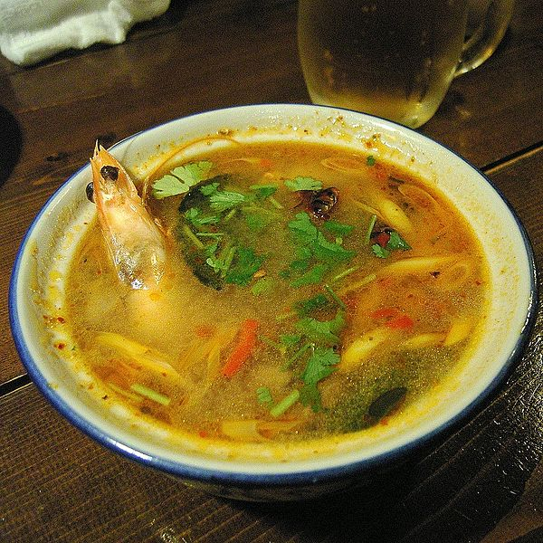

# Thai Food


<sup>[Image CC BY-SA 3.0](https://lh6.googleusercontent.com/ZXUp_utp_lJJGF70BC5KtJWeJhRKQbThT3pU-8fOi5DnQshT0b4tsQEWsMSIVRoQ13aX_FXgTZBaZNrmwyT5I8yn9l_0ftxDyOSLaWG62xoVyIt7wLYmj_OcVB4AMoRvrB02IRyK)</sup>


<sup>[Image CC BY-SA 3.0](https://en.m.wikipedia.org/wiki/File:Tom_yum.jpg)</sup>

## Install

### Node.js

```
$ npm install thaifood
```

## Usage

### Node.js

```javascript
import { padthai, tomyam, kaomangai } from 'thaifood';

console.log(padthai(' Hello Cook ', 20)); // prints "padt Hello Cook padt"
```

